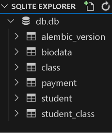

# SETTING UP RELATIONSHIPS IN SQLALCHEMY    

This section is going to assume you have knowledge in how relationships works in databases and the various cardinalities that exist.    
- one-to-one
- one-to-many
- many-to-many      

In any case you are not quite conversant with the topic you can have a look at the article [Types of Relationship in DBMS - Scaler](https://www.scaler.com/topics/types-of-relationship-in-dbms/)   

For our example, we will still be using our student model but we will add a few  models to it and model the relationship among them.

### 1:1 relationship Student <----> BioData
We will add a bio model with the Schema below.   
```
Course -> id,aspiration,religion,nationality,highschool
```     
There is a one to one relationship between student and biodata as a student can only have one and not multiple bio's.    
The model constructed in sqlalchemy looks as follows.   
```
class BioData(Base):
    __tablename__= 'biodata'
    id= Column(Integer,primary_key=True)
    aspiration = Column(String(40), nullable=False)
    religion = Column(String(40), nullable=False)
    nationality = Column(String(40), nullable=False)
    highschool = Column(String(40), nullable=False)
    student_id= Column(Integer,ForeignKey('student.id'))
```     
Assume the relevance of the fields, the fact that it is in conflict with some related fields like hometown and age in the student model and rather focus on the concept of adding a 1:1 relationship. Like Mizaru, see no evil 🙈.   

We will also add an attribute in the student model to establish the relationship.   
` biodata= relationship('BioData', backref='student', uselist=False) ` 

### 1:M relationship Student <----> Payment 
There is a one to many relationship between Student and Payment as a student can make payments multiple times and a payment can only belong to a single student.       
```
class Payment(Base):
    __tablename__= 'payment'
    id= Column(Integer,primary_key=True)
    amount = Column(Float,nullable=False)
    description = Column(String(50),nullable=False)
    date = Column(DATETIME,default=datetime.now())
    student_id = Column(Integer, ForeignKey('student.id'))
```     
Add the relationship in the student model also.      
` payment = relationship('Payment', backref='student') `     

We have thus established a one-to-many relationship between the Student and Payment model.    

### M:M relationship Student <----> Class(unit)

A student can belong to many classes. and a single class can be taken by many students. 

The class model 
```
class Class(Base):
    __tablename__= 'class'
    id = Column(Integer,primary_key=True)
    name = Column(String(50), nullable=False)
    students = relationship('Student', secondary=student_class, back_populates='classes')
```     
on the Student Model we will also add the following line to establish the relationship.          
` classes = relationship('Class', secondary=student_class, back_populates='students') `     
We will also add an intermediary association table for the Student and the Class so as to act as a bridge between the two tables.   
```
student_class = Table(
    'student_class',
    Base.metadata,
    Column('student_id', ForeignKey('student.id'), primary_key=True),
    Column('class_id', ForeignKey('class.id'), primary_key=True),
    extend_existing=True,
)
```     

### Modelled Relationships  
In Our models.py file the final output should be similar to the one below.    
```
import datetime

from sqlalchemy import create_engine,Column, Integer, String,Float,ForeignKey,DateTime,Table,func
from sqlalchemy.orm import declarative_base,sessionmaker,relationship

Base = declarative_base()

# association table 
student_class = Table(
    'student_class',
    Base.metadata,
    Column('student_id', ForeignKey('student.id'), primary_key=True),
    Column('class_id', ForeignKey('class.id'), primary_key=True),
    extend_existing=True,
)

#student Model
class Student(Base):
    __tablename__ = 'student'
    id= Column(Integer,primary_key=True)
    first_name = Column(String(40), nullable=False)
    last_name = Column(String(40), nullable=False)
    age = Column(Integer, nullable=False)
    home_town = Column(Integer, nullable=False)

    # relationships
    biodata= relationship('BioData', backref='student',uselist=False)
    payment = relationship('Payment',backref='student')
    classes = relationship('Class', secondary=student_class, back_populates='students')

    def __repr__(self):
        return f'<Student: {self.first_name}>'
    
# Biodata model
class BioData(Base):
    __tablename__= 'biodata'
    id= Column(Integer,primary_key=True)
    aspiration = Column(String(40), nullable=False)
    religion = Column(String(40), nullable=False)
    nationality = Column(String(40), nullable=False)
    highschool = Column(String(40), nullable=False)
    student_id= Column(Integer,ForeignKey('student.id'))

# Payment Model
class Payment(Base):
    __tablename__= 'payment'
    id= Column(Integer,primary_key=True)
    amount = Column(Float,nullable=False)
    description = Column(String(50),nullable=False)
    date = Column(DateTime(), server_default=func.now())
    student_id = Column(Integer, ForeignKey('student.id'))

#class Model
class Class(Base):
    __tablename__= 'class'
    id = Column(Integer,primary_key=True)
    name = Column(String(50), nullable=False)
    students = relationship('Student', secondary=student_class, back_populates='classes')


engine= create_engine('sqlite:///db.db')
Base.metadata.create_all(engine)
Session = sessionmaker(bind = engine)
session = Session()
```     

Note: Order Matters in terms of your Model definitions and should be similar to the one above.  
After creating relationships the next step is use alembic to generate our revision and upgrade to add the new database tables.     
Open the terminal and use the commands below to generate the tables.    
` alembic revision --autogenerate -m "Add Relationships" `  
` alembic upgrade head `  

You should get a new database Schema similar to the one depicted on the image below.    
 


